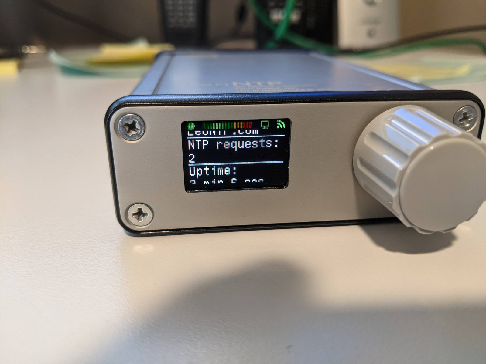

# Leo NTP Monitor


My network _had_ a ntp server.  However, that ntp server was silently failing when talking to the ntp pool of timeservers.  Bad things 
happen when the time isn't properly set on your various gadgets.  So I decided to add this 
[LeoNTP Networked Time Server](http://www.leobodnar.com/shop/index.php?main_page=product_info&products_id=272) device 
to my network.  It uses the GPS satellite's atomic clock to provide a highly accurate stratum-1 time 
source to your network.

I was noticing that the satellite lock was not stable.  I was going to need something more advanced 
than just looking at the display - I needed to store and visualize the time-series data, and 
that is what this project does.

I have tested this on both amd64/arm64 hardware architectures.  I specifically run this on a raspberry pi 4 running 
Ubuntu Server 64bit.

## Getting Started

You will need to have InfluxDB 2.x setup. This version comes with visualization support, but 
Grafana has more advanced features.  I have a [docker-compose](https://github.com/sean-foley/influx) 
file that will spin up an Influxdb and Grafana visualization tier to help out.

### Prerequisites

You will need to have docker and docker-compose installed on your host machine.  

### Installing

First, clone the repo...

```
git clone https://github.com/sean-foley/leo-ntp-monitor.git
```

Then build the docker image.  There is a handy makefile target for this because 
I always forget the docker syntax...

```
make build
```

Edit the docker-compose.yml file and set the NTP host name/ip address, Influxdb org name, 
bucket name, and api token.  Once the configuration is set, you can start the container...

```
docker-compose up
```

If everything looks good and you started the container as specified above, then you can press CTRL-C to stop it.

Now start the container headless...
```
docker-compose up -d
```

## Built With

* [Docker](https://www.docker.com/) - Container support
* [Docker-Compose](https://docs.docker.com/compose/install/) - Container orchestration
* [GitHub](https://github.com/) - Source control

## Contributing

I will take pull requests, but the reality is this project is so small that you're probably better off 
just forking it.

## License

This project is licensed under the MIT License - see the [LICENSE.md](LICENSE.md) file for details

## Acknowledgments
**Billie Thompson** - *for the README.md template* - [PurpleBooth](https://github.com/PurpleBooth)

**LEO NTP Stats** - *statistics protocol definition* [LeoNTP-Stats](https://www.leontp.com/firmware/LeoNTP-stats.zip)
